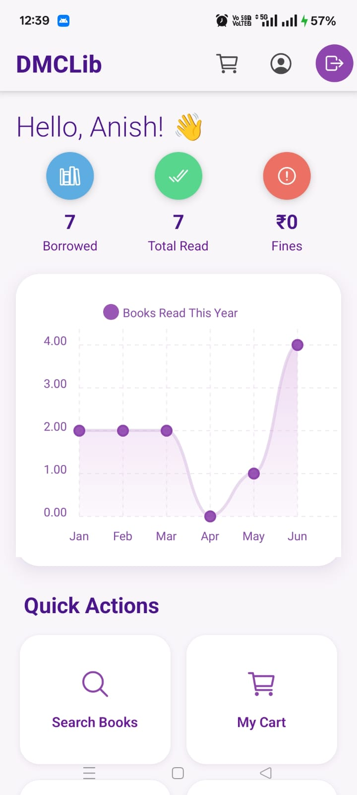
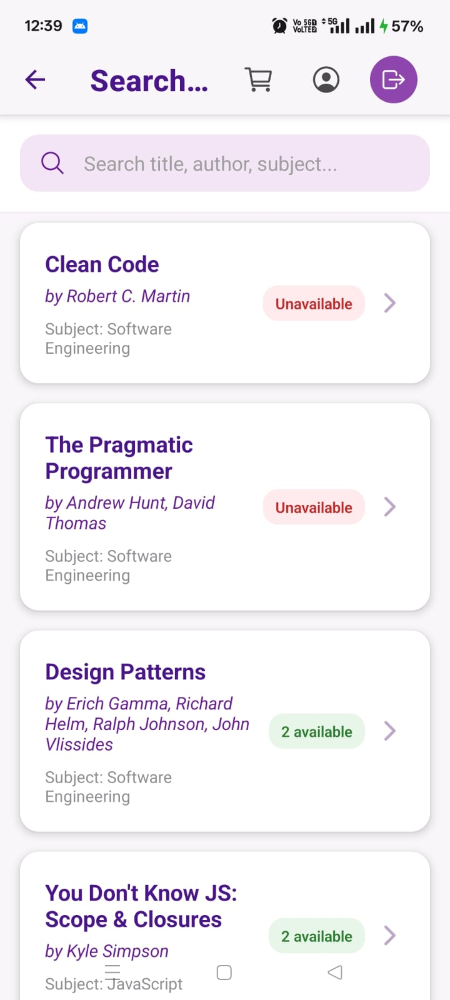
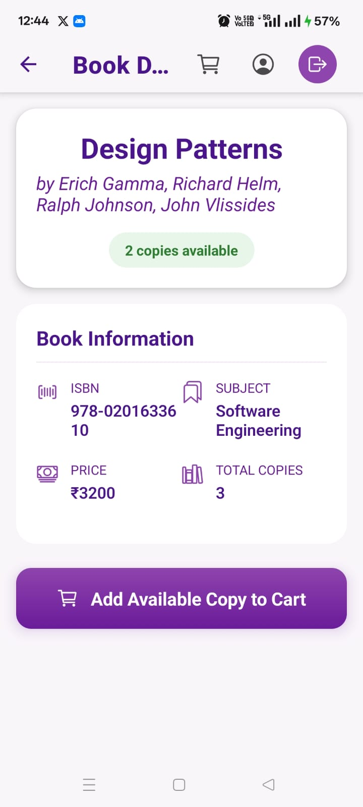
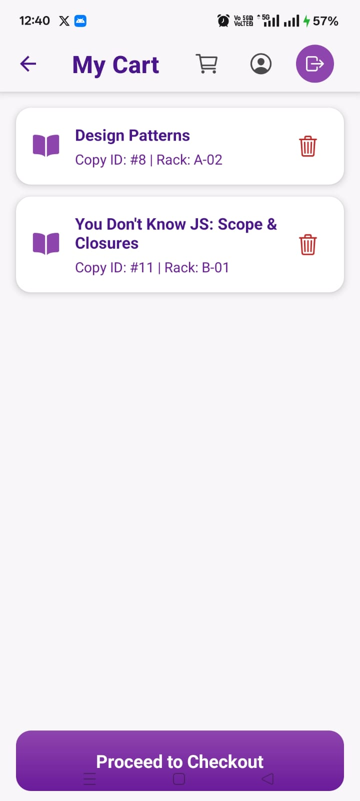
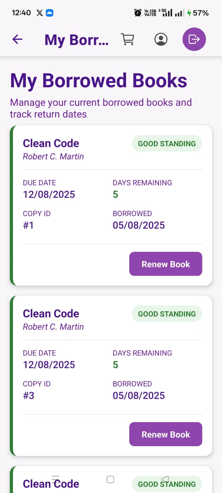
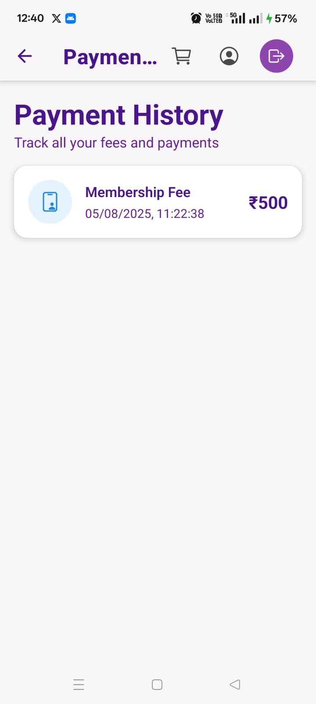

# ShelfSync (Or DMCLib) - A Modern Library Management System

A full-stack library management system featuring a self-service mobile app for members (React Native & Expo) and a powerful administrative backend for staff (Java, Spring Boot, MySQL).

   

## ✨ Overview

**ShelfSync** is a comprehensive, role-based application designed to modernize the operations of a commercial library. It provides a seamless digital experience for library members while offering robust management and analytics tools for librarians and owners. The system is architected with a clear separation of roles, ensuring security and a tailored user experience for each user type.

## 🚀 Key Features

The application is built around three core user roles:

### 👤 Member (React Native Mobile App)
*   **Self-Service Onboarding**: Secure user registration and login.
*   **Book Discovery**: Browse the entire library catalog or use a powerful search function.
*   **Shopping Cart**: Add available book copies to a personal cart before borrowing.
*   **Automated Checkout**: Borrow all books in the cart in a single transaction. Membership fees are automatically handled if expired.
*   **Personal Dashboard**: View borrowing history, payment history, and manage account details.
*   **Fine Tracking**: See a real-time calculation of any outstanding fines for overdue books.

### 🧑‍💼 Librarian (API-driven)
*   **Inventory Management**: Add new book titles and multiple copies to the library catalog.
*   **Circulation Control**: Manually issue and process the return of books.
*   **Financial Operations**: Collect fines and membership fees.
*   **Operational Dashboard**: View daily statistics and a list of all overdue books that require action.

### 👑 Owner (API-driven)
*   **Business Intelligence Dashboard**: High-level KPIs for revenue, member growth, asset value, and book circulation.
*   **Financial Reporting**: Detailed reports on revenue, expenses, and profitability.
*   **Asset Tracking**: In-depth analysis of the library's book inventory and total asset valuation.
*   **User Analytics**: Statistics on member activity, retention rates, and engagement.

## 🛠️ Technology Stack

The project is built with a modern, robust technology stack, separating the backend API from the client-side mobile application.

### Backend
*   **Framework**: Spring Boot 3.2.5
*   **Language**: Java 17
*   **Database**: MySQL 8
*   **ORM**: Spring Data JPA (Hibernate)
*   **Security**: Spring Security with JWT (JSON Web Tokens) for role-based authentication.
*   **API Documentation**: OpenAPI 3.0 (Swagger UI)

### Frontend (Member App)
*   **Framework**: React Native (with Expo SDK 51)
*   **Language**: JavaScript (ES6+)
*   **Navigation**: React Navigation (Native Stack)
*   **State Management**: React Context API
*   **API Client**: Axios

## 📸 Screenshots

*(**TODO**: Replace these placeholder links with screenshots of your actual running application.)*

| Dashboard | Search & Browse | Book Details |
| :---: | :---: | :---: |
|  |  |  |

| My Cart | Borrowed Books | Payment History |
| :---: | :---: | :---: |
|  |  |  |


## ⚙️ Getting Started

To get the project up and running locally, follow these steps.

### Prerequisites
*   Java Development Kit (JDK) 17 or later
*   Apache Maven 3.6+
*   MySQL Server 8.0+
*   Node.js (LTS version)
*   Expo Go app on your mobile device

### 1. Backend Setup
```bash
# Clone the repository
git clone https://github.com/AK1003018/ShelfSync.git

# Navigate to the backend directory (assuming it's in a 'backend' folder)
cd ShelfSync/backend

# Configure the database
# Open src/main/resources/application.properties and update the following lines with your MySQL credentials:
# spring.datasource.username=your_mysql_username
# spring.datasource.password=your_mysql_password

# Run the Spring Boot application
mvn spring-boot:run
```

- > The backend will start on http://localhost:5454. 
- > The Owner (owner@library.com) and Librarian (admin@library.com) users will be created automatically on the first run.

### 2. Frontend Setup
```bash
# Navigate to the frontend directory (assuming it's in a 'frontend' folder)
cd ../frontend

# IMPORTANT: Configure the API endpoint
# Open src/api/api.js and replace 'YOUR_COMPUTER_IP_ADDRESS' with your computer's local IP address.
# const API_BASE_URL = 'http://192.168.1.10:5454/api'; // Example

# Install dependencies
npm install

# Start the Expo development server
npm start
```


#### Scan the QR code with the Expo Go app on your phone.
- 🌐 API Documentation
#### The backend includes interactive API documentation powered by Swagger UI. 
#### Once the backend is running, you can access it at:
- http://localhost:5454/swagger-ui.html
#### You can use this interface to test all API endpoints for every user role directly from your browser.
- 📄 License
#### This project is licensed under the MIT License.
